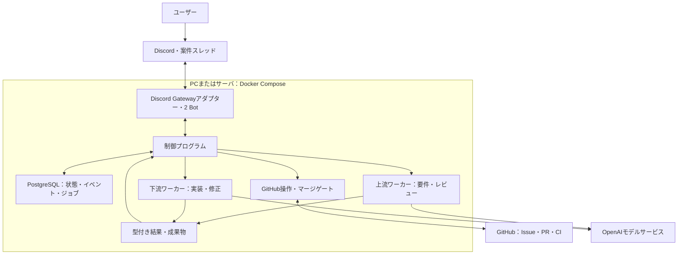
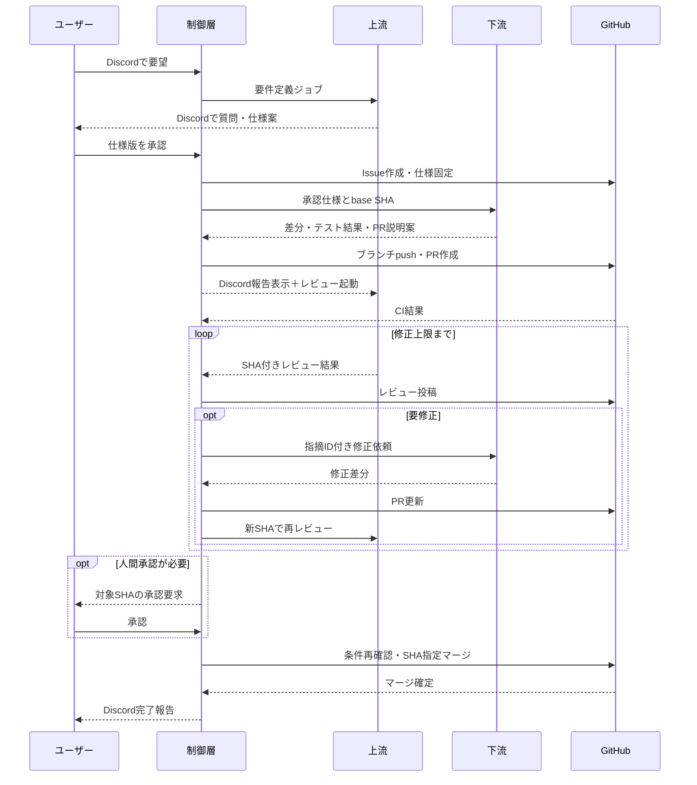
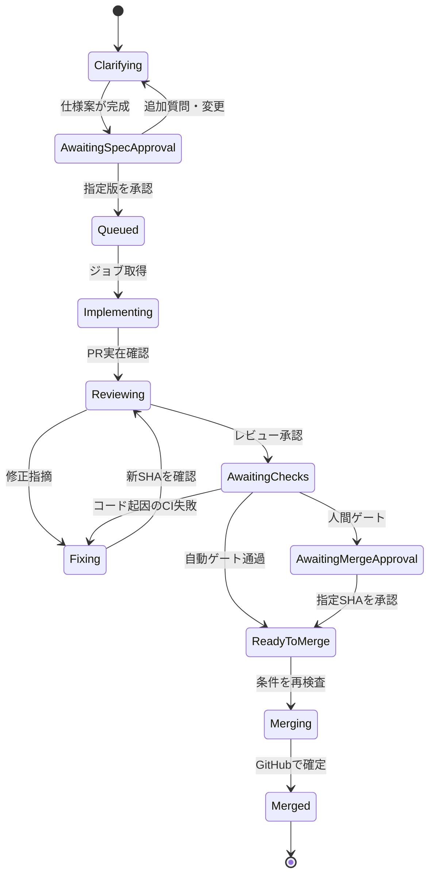

# Discord連携・2エンジニア開発チーム 要件定義・仕様書

版: 0.1 / 作成日: 2026-09-12 / 状態: 実装計画作成用ドラフト

## 0. 本書の読み方と確定範囲

本書だけで、別のエンジニアが構成検討、技術検証、作業分解、見積もり、テスト計画を作成できることを目的とする。実装済み・接続済みであることを示す文書ではない。具体的な製品バージョン、アカウント権限、料金は実装着手時に再確認する。

| 区分 | 内容 |
|---|---|
| ユーザー要求・確定 | 上流エンジニアと下流エンジニアの2役を作る |
| ユーザー要求・確定 | ユーザーが要望を伝え、上流が要件定義、下流が実装する |
| ユーザー要求・確定 | Discord上でPR作成報告・レビュー依頼などのやり取りが見える |
| ユーザー要求・確定 | レビュー、修正、masterへのマージまで連携させる |
| ユーザー希望 | Dockerを用いてPCとサーバの両方で運用できる |
| 本書の設計提案 | Docker Compose、Python制御層、PostgreSQL、独立したCodex実行プロセス |
| 安全な初期設定案 | 仕様は人間が承認。初期のマージは人間承認、検証後に条件付き自動マージへ移行 |
| 未確定 | 対象リポジトリ、ホストOS、認証方式、モデル、予算、CIコマンド、正式運用時の自動マージ範囲 |

「必須」は本仕様案の受け入れ条件、「初期値」は変更可能な提案を意味する。未確定項目の回答がなくてもモックによる実装は進められるが、実アカウントを使う結合試験・自動マージ開始の前に決定する。

## 1. 目的・対象・非対象

### 1.1 目的

ユーザーがDiscordで自然言語の要望を伝えると、要件整理、仕様の合意、実装、PR作成、レビュー、修正、マージまでを追跡可能な形で進める。ユーザーは仕様と重要な判断に集中する。

### 1.2 MVPの対象

- 1人のオーナー、1つのDiscordサーバ、許可済みの1つのGitHubリポジトリ。
- 2つの論理エージェントと2つのDiscord Bot表示名。
- 1案件につきDiscordスレッド1つ、GitHub Issue1つ、実装PR1つ。
- 同時に実装する案件は1つ。複数の依頼は保存して順番に処理する。
- 対象はDocker内で編集・テスト可能なソフトウェア。最初の実証対象は小さなPythonリポジトリを推奨。
- masterを初期のマージ先とするが、設定でmain等へ変更できる。存在しないブランチは勝手に作らず停止する。
- セルフホスト型Codex実行。OpenAIが提供するCodex Cloudへの外部起動APIには依存しない。

### 1.3 非対象

- 本番デプロイ、本番DB操作、課金・契約、外部顧客への送信。
- 不特定多数向けBot、複数企業のマルチテナント、複数リポジトリをまたぐ変更。
- エージェントによる自己権限拡張、Bot設定・制御プログラム・承認ルールの自動変更。
- iOSネイティブビルドなどホスト固有環境、GPU計算、任意のDockerコンテナをエージェントから起動する機能。
- 24時間稼働をPCの電源OFF中にも保証すること。継続運用にはサーバ等の常時稼働ホストが必要。

## 2. 全体構成



### 2.1 設計の核心

Discord上の会話はユーザー向けの表示であり、ジョブ起動の唯一の根拠にはしない。下流が構造化された「実装完了」を返し、制御層がPRを実在確認してから、Discordへの報告と上流レビューのジョブ登録を行う。

これにより、Bot発言の読み合いによる無限ループ、通知欠落による停止、偽の「レビュー承認」投稿によるマージを防ぐ。下流から上流へのメンションは表示として行うが、そのメンション受信を再度ジョブ化しない。

### 2.2 実行場所

コード編集・テスト・Codexプロセスは自分のDockerホスト上で動き、モデル推論は外部サービスを利用する。Dockerを使ってもモデルがローカル推論になるわけではない。Codex CLIのホスト実行とCodex Cloudは別方式であり、本MVPは前者を採用する。

## 3. 役割と責務

| 主体 | 行うこと | 行わないこと |
|---|---|---|
| ユーザー | 要望提示、質問回答、仕様承認、重要変更承認、停止 | 実装詳細を毎回指示する必要はない |
| 上流エンジニア | 要件整理、既存仕様調査、質問、受け入れ条件作成、PRレビュー、修正指示 | 自分で実装を直して自分で承認しない。承認条件を変更しない |
| 下流エンジニア | 承認仕様に基づく計画・実装・テスト、PR説明案、修正対応 | 要件の独断変更、レビュー承認、masterへのpush・マージ |
| 統括・PM（拡張） | 依頼の分解、担当割当、進捗監視、安全な再試行、判断事項の集約 | 仕様・権限・支出・公開・マージの承認代行 |
| 情シス・SRE（拡張） | 実行環境、CI、Bot、GitHub連携の診断と修正案 | 認証情報の閲覧、基盤変更の自己承認、本番への直接反映 |
| 制御プログラム | 状態遷移、権限検査、ジョブ登録、GitHub操作、Discord通知、機械的マージ判定 | LLMの自由文だけで完了や承認と判断しない |
| GitHub CI | 信頼済み定義に基づくテスト・静的解析・必要な検査 | エージェントの「テスト成功」申告で成功扱いしない |

上流は「要件定義モード」と「レビューモード」を使い分ける。レビューは新しいセッションで開始し、承認仕様、対象SHA、差分、関連ソース、CI結果を入力する。下流の思考履歴は承認の根拠にしない。

## 4. ユーザー体験・Discord仕様

### 4.1 チャンネルと会話

- 許可チャンネルの通常メッセージを統括・PMが受け取り、既定の案件種別へ割り当てて案件IDとスレッドを作る。Slash Commandは明示操作と復旧用に残す。
- 拡張構成ではgeneralを受付とし、情シス・SREがリポジトリごとの専用チャンネルを管理する。案件・話題はそのチャンネル内のスレッドで進め、repository IDとchannel IDの対応をDBで固定する。
- スレッド内でユーザーは自然言語で追加説明できる。上流が最大5件を目安に質問をまとめる。
- スレッド外の雑談、他ユーザー、他Bot、Webhook発言は自動実行の指示として扱わない。
- Message Content Intent等の必要設定を導入手順に明記する。利用できない場合は `/answer task:<id> text:<回答>` で代替可能にする。
- 通知は上流・下流それぞれのBot名義で送る。ユーザーが書いたテキストをそのまま全体メンションとして再送しない。
- 長文仕様は要約と添付MarkdownまたはGitHubの参照先を表示する。機密ログ全文は投稿しない。

### 4.2 コマンド・操作

| 操作 | 意味 | 権限・ガード |
|---|---|---|
| `/request` | 新規案件作成 | 許可ユーザー・repo aliasのみ |
| `/answer` / スレッド返信 | 要件への回答・追加情報 | 現案件に対応すること |
| 仕様承認ボタン | 指定版の仕様を承認 | task ID、spec version、hashを検証 |
| `/status task:<id>` | 状態、担当、PR、停止理由を表示 | 許可ユーザー |
| `/revise task:<id> text:<内容>` | 承認済み要件の変更申請 | 旧承認失効、実行中作業を安全に停止 |
| マージ承認ボタン | 指定head SHAのマージを承認 | human_gateモード。機械的ゲートも必須 |
| `/pause` / `/resume` | 一時停止・再開 | 状態と実行リースを検査 |
| `/cancel` | キャンセル | 新規副作用停止。既存PR・ブランチは残す |
| `/retry` | 停止原因解消後の再実行 | 人間のみ。既存副作用を照合 |

Slash Commandとボタンは速やかに受付応答し、長時間処理は非同期化する。期限切れのInteraction応答に依存せず、永続化したchannel/thread IDへBotとして結果を投稿する。

### 4.3 表示例

```text
ユーザー: CSVで取引履歴をダウンロードできるようにしたい。
上流: 対象期間、文字コード、出力項目、アクセス権を確認させてください。
上流: TASK-001の仕様v2を作成しました。[仕様を確認] [v2を承認]
ユーザー: [v2を承認]
上流: 下流エンジニアへ実装を依頼しました。Issue #10。
下流: PR #12を作成しました。@上流 レビューをお願いします。CI実行中です。
上流: REV-01: 他ユーザーの取引が出力されないことを検証するテストが不足しています。
下流: REV-01を修正しました。新しいコミットを再レビューしてください。
上流: 対象SHA abc123を承認しました。CIとマージ条件を確認します。
上流: masterへのマージを確認しました。PR #12、merge SHA def456。
```

## 5. 業務フロー



図中の上流からユーザーへの発言も、実際の送信は制御層の通知経路を通す。

## 6. 状態遷移



全ての非終端状態から `Paused`、`Blocked`、`Cancelled` に遷移できる。DBは状態名、直前状態、停止理由、再開予定状態を保存する。Paused解除時は古い実行をそのまま継続せず、仕様版・GitHub状態・リースを再検証する。

- 曖昧な要件・対象不明はClarifyingで質問する。実装開始後に判明した仕様不足はBlockedにして人間へ戻す。
- レビュー後のhead SHA変更はレビュー承認とマージ承認を失効させReviewingへ戻す。
- base変更は最新baseを取り込み、統合テスト・再レビュー後に進める。競合は下流で解消し、仕様判断を要する場合はBlocked。
- 要件変更はspec versionを増やして承認を取り直す。旧版ジョブの完了イベントは採用しない。
- CIのインフラ障害はコード修正指示に変換せず、再試行後Blockedにする。
- 手動マージはGitHubで検知し、`merged_externally`として監査する。システムレビュー済みと偽装しない。
- 手動PRクローズはBlocked。勝手に再作成・再オープンしない。
- Cancelledは原則終端。既にマージした変更をキャンセルで巻き戻さない。

## 7. 要件定義・成果物の契約

### 7.1 上流が作成する案件仕様

以下を含むUTF-8 Markdownを必須とする。

1. 背景、目的、ユーザー、解決対象の問題。
2. 対象範囲と対象外。
3. 機能要件ID（FR-001等）、正常系・異常系・権限。
4. 入出力、画面/API/データ項目、互換性。
5. 非機能要件、性能目標、機密性、運用条件。
6. 受け入れ条件ID（AC-001等）と具体例。
7. テスト観点、既存テストとの関係。
8. 制約・禁止変更・危険箇所。
9. 未決事項、採用した仮定と根拠。
10. task ID、spec version、作成日時、変更履歴。

承認時に本文のhashと承認者IDを固定する。重大な未決事項が残る仕様は実装キューへ入れない。単なるDiscordの「OK」は仕様承認にしない。

### 7.2 保存先と正本

| 情報 | 正本 | 複製・表示 |
|---|---|---|
| 案件状態・承認・ジョブ | PostgreSQL | Discord状態通知 |
| 承認仕様 | DB内の不変バージョン本文とhash | Issue本文、PR内docs/tasks/TASK-ID/spec.md |
| コード・PR・CI | GitHubの現状態 | DB内キャッシュ、Discord要約 |
| 大きいログ・差分 | artifacts永続ボリューム | DBに相対パス・hash |

Issue本文が手動編集されても承認仕様の差し替えとはみなさない。ユーザーが仕様変更を承認して初めて新しい版を採用する。実装担当がPR内のspec.mdを改変した場合、hash不一致として停止する。

### 7.3 下流からの返却

- 実装計画、変更概要、変更ファイル一覧、要件IDとテストの対応。
- 実行したテスト、終了コード、ログ参照。未実行の理由。
- base SHA、差分成果物、依存追加、リスク、残課題、PRタイトルと説明案。
- `status = completed | needs_clarification | blocked | failed`。

`completed`はワーカー作業完了であり、PR成功やマージ完了ではない。制御層が差分、対象パス、テスト証跡を検証し、信頼済みのpublisherがブランチとPRを作る。表示上は「下流がPR作成」とするが、GitHub書き込み認証情報はLLM実行プロセスに渡さない。

### 7.4 上流からのレビュー返却

```json
{
  "schema_version": 1,
  "task_id": "TASK-001",
  "spec_version": 2,
  "spec_hash": "sha256:...",
  "head_sha": "...",
  "base_sha": "...",
  "decision": "request_changes",
  "findings": [
    {
      "id": "REV-01",
      "severity": "high",
      "requirement_id": "AC-003",
      "file": "tests/test_export.py",
      "line": 42,
      "reason": "別ユーザーのデータ混入を検出できない",
      "requested_change": "権限境界のテストを追加する"
    }
  ],
  "coverage": [{"acceptance_id": "AC-003", "status": "not_met", "evidence": "..."}],
  "summary": "権限境界の検証が不足"
}
```

decisionは `approve | request_changes | needs_human`。severityは `critical | high | medium | low`。未解決critical/high/medium、未充足必須AC、証拠不足があればapprove不可。lowは理由付きで非ブロッキングとする。コード・行番号は対象SHAに存在するか検査し、無効なら一般PRコメントとして位置不明を明示する。

## 8. GitHub連携・マージの仕様

### 8.1 識別・ブランチ

- repositoryは設定済みaliasから解決する。Discordに任意URLを渡してcloneさせない。
- featureブランチは `agent/TASK-ID/slug`。同じ案件では既存PRを再利用する。
- PR本文にtask ID、spec version/hash、AC対応、テスト、リスクを含める。
- masterへの直接push、force push、保護ルールの回避は禁止。
- MVPはsquash mergeを初期提案とする。リポジトリポリシーに合わせ設定可能にする。

### 8.2 権限境界

GitHub App等の専用認証を使用し、少なくとも「PR作成主体」と「レビュー承認主体」を分ける。同一主体による自己承認に依存しない。必要なGitHub App権限・プラン・ブランチ制約の適用可否は技術検証P0で確認する。

制御サービスだけがGitHub資格情報を持ち、ワーカーはソースと成果物だけを扱う。publisherは許可featureブランチへの書き込み、reviewerは対象PRのレビュー、mergerはゲート通過したPRのマージに限定した内部APIを持つ。資格情報の実際の権限が広い場合も、サービス側でrepo/branch/operation allowlistを強制する。プロンプトだけの制限を権限制御とみなさない。

### 8.3 モード

| モード | 動作 |
|---|---|
| human_gate（初期） | 上流承認＋CI成功＋ユーザーのSHA指定承認でマージ |
| auto_low_risk（目標） | 許可された低リスク変更のみ上流承認＋CI成功で自動マージ |
| disabled | PRとレビューまで。自動マージ操作は一切しない |

auto_low_riskへの切替はホスト設定の明示変更を必要とする。Bot会話やLLM出力で切り替えない。

### 8.4 機械的ゲート

マージ直前に全条件を再取得・検証する。

- 現在の仕様版とhashが承認済み。
- PRのrepo、base、head branch、作者、task IDが登録と一致。
- draftでなく、openであり、競合なし。
- 承認が現在のhead SHA・base SHA・仕様版に対応。
- 必須CIが対象コミットに対してsuccess。pending/unknown/skipped/neutralを成功とみなさない。
- 必須check名だけでなく発行主体も信頼済み設定と一致。
- 未解決ブロッキング指摘なし。保護ルールが要求する会話解決等も充足。
- 禁止ファイル変更・高リスク変更・秘密情報検知なし。
- 自動モードの許可パス、変更量上限等を満たす。不明は人間承認へ。
- 必要な人間承認が現在のSHAに対応し、有効期限内。
- paused/cancelledでなく、予算・時間上限を超えていない。

最新base追従をブランチ保護またはmerge queue等でも強制し、API呼び出しには期待head SHAを渡す。競合・SHA不一致・保護ルール拒否を迂回しない。APIタイムアウト時は再マージ前に実際のmerged状態を問い合わせる。成功通知はmergedフラグとmerge commit SHAの取得後のみ。

### 8.5 高リスク判定

認証・認可、課金、DBスキーマ移行、CI定義、依存lockfile、Dockerfile、インフラ設定、制御層・エージェント指示・承認ルールの変更は初期設定では自動マージ不可。パスルールと上流の意味的レビューを併用する。判定できない変更は低リスク扱いしない。

## 9. Docker・PC/サーバ共通運用

### 9.1 採用構成案

Linuxコンテナ＋Docker Compose v2を利用する。LinuxサーバはDocker Engine、macOS/Windows PCはLinuxコンテナを実行できるDocker環境を想定する。Windows固有パスに依存しない。amd64/arm64の両方で必要なCLIと依存が動くかP0で検証する。両対応不能ならサポート対象を明記し、暗黙のエミュレーション前提にしない。

| サービス | 常駐 | 永続データ | 保有する秘密 |
|---|---|---|---|
| discord-gateway | する | DB経由 | 上流/下流Botトークン |
| orchestrator | する | PostgreSQL | DB・内部API認証 |
| github-service | する | DB内操作記録 | GitHub App資格情報 |
| upstream-worker | 待機、処理時Codex起動 | 案件専用作業領域 | モデル利用資格情報のみ |
| downstream-worker | 待機、処理時Codex起動 | 案件専用作業領域 | モデル利用資格情報のみ |
| postgres | する | db-data volume | DB認証 |

PostgreSQLのジョブテーブルとリースを使い、MVPではRedisや外部キューを必須にしない。モジュールは分離し、プロセス数の統合は権限境界を維持できる場合だけ実装時に検討する。

### 9.2 ネットワーク

Discord Gatewayへの外向き接続で受信し、GitHubのPR/CIは初期値60秒のポーリングで照合する。これによりPCでも公開Webhookエンドポイントや固定IPを不要にする。再接続・差分照合・API rate limitへの対応は必須。

DB、内部制御APIはホストへ公開しない。管理用ポートを設ける場合はloopback限定。ワーカーからDB・Bot・GitHub秘密への経路を設けない。ソース受け渡しと成果物回収にはジョブIDと限定スコープの内部APIまたは専用領域を使用する。

外向き通信はモデルAPI、許可GitHub API、承認された依存レジストリ等に限定する方針とし、実際のegress制限方式はP0で検証する。Dockerネットワーク設定だけで厳密なドメイン制限ができると仮定しない。モデル利用キーをワーカーが扱うため、完全な秘密隔離は別途認証プロキシ等が必要。初期は専用キーと支出制限、信頼済み私有リポジトリに対象を絞る。

### 9.3 ストレージと作業分離

- named volumesを基本とし、db-data、artifacts、上流workspace、下流workspaceを分離する。
- ホストのホームディレクトリ、SSH鍵、業務フォルダを丸ごとマウントしない。
- 上流と下流は共有の書き込みGitメタデータを持たず、案件用の独立cloneを基本とする。同一信頼境界内の作業分離だけにworktreeを使う。
- レビューには指定SHAの読み取り専用ソースを渡す。テスト実行が必要なら別の使い捨て作業領域を用いる。
- Docker socket、privileged、host network、無制限なhost bind mountは禁止。
- 非root、不要capability削除、no-new-privileges、CPU/メモリ/PID上限、可能な範囲のread-only root filesystemを設定する。
- Dockerは完全な敵対コード用隔離ではない。未知の公開リポジトリ実行はMVP対象外。

### 9.4 配布・起動の契約

実装成果物にはcompose.yaml、Dockerfile群、設定サンプル、秘密ファイルサンプル（値なし）、DB migration、セットアップ・バックアップ・復旧手順を含める。

想定操作は `docker compose up -d --build`、`docker compose logs`、`docker compose stop`。これらが利用できる完成物を実装するという要件であり、現時点でcomposeファイルは存在しない。

秘密はGit管理外の制限付きファイルから読み取り専用マウントする。Compose secretsは保存時暗号化を自動保証しないため、ホスト側の権限・ディスク保護も必要。Codex認証は専用APIキー方式を第一候補にし、契約・利用方式・非対話認証の可否を検証する。既存のChatGPT契約だけで追加料金なしに動くとは仮定しない。

PC移行とサーバ移行は、同じ固定バージョンのイメージ・設定・DBバックアップ・artifactsから復元可能にする。移行元を止め、復元先だけ起動する。2台が同時に同じBot・案件を実行しないようDBリーダーロックとrun epochを持つ。

### 9.5 初期容量の仮置き

Dockerに4 vCPU・8 GiB RAM・空き30 GiBを割り当てる構成から負荷試験する。これは製品最小要件や性能保証ではない。ブラウザテストや大きなビルドは増強が必要。モデル推論用GPUは本方式では要求しない。待機ワーカーは軽量、LLMセッションは仕事の発生時だけ起動する。

## 10. 制御層・データ・ジョブ契約

### 10.1 コンポーネント境界

- DiscordAdapter: 受信正規化、ユーザー認可、通知。
- TaskService: 状態遷移と承認。LLMを呼ばなくてもテスト可能。
- JobQueue: enqueue/claim/heartbeat/complete/fail。DBトランザクションを用いる。
- AgentRunner: Codex起動、入力生成、構造化結果検証、タイムアウト・停止。
- GitHubService: fetch/publish/create_issue/create_pr/post_review/check/merge。限定操作のみ。
- PolicyEngine: 禁止変更、レビュー・CI・マージガード。LLMに変更させない。
- Reconciler: PR・CI・停止中ジョブ・不明な外部操作の照合。
- NotificationOutbox: 確定した状態変更のDiscord送信。

### 10.2 必須テーブル

| テーブル | 主な属性・制約 |
|---|---|
| tasks | id、repo alias、thread ID、state、state version、spec version、issue/PR番号、base/head SHA、pause reason |
| spec_versions | task ID、version、本文、hash、作成日時。task/version一意、承認後不変 |
| approvals | task ID、種別、spec hash、head/base SHA、actor ID、期限、失効日時 |
| jobs | id、task、role、kind、attempt、status、lease owner/expiry、fencing token、入力hash、timeout |
| agent_runs | job、session ID、model、CLI版、prompt版、開始終了、usage、結果参照 |
| events | source、external ID、task、type、payload、日時。source/external ID一意 |
| reviews | task、head/base SHA、spec version、decision、findings、GitHub review ID |
| external_operations | idempotency key、種別、対象、開始状態、結果、外部ID |
| outbox | event ID、宛先、Bot役、本文参照、送信結果、retry日時 |
| artifacts | task/run、相対パス、hash、種類、保持期限 |

時刻はUTC、表示はAsia/Tokyoを初期値とする。Discord/GitHubのIDは精度喪失を避け文字列で扱う。

### 10.3 イベント例

```json
{
  "schema_version": 1,
  "event_id": "uuid",
  "type": "implementation.completed",
  "task_id": "TASK-001",
  "job_id": "uuid",
  "spec_version": 2,
  "spec_hash": "sha256:...",
  "fencing_token": 4,
  "artifact_ref": "TASK-001/run-004/result.json"
}
```

受信時はschema、role、task、現在のspec版、ジョブ所有者、fencing token、許可状態を検証する。古いワーカーの完了を破棄する。型不正な結果を自由文から推測して成功にしない。

### 10.4 Codexアダプター

非対話CLIを第一候補とし、構造化イベント、結果schema、終了コードを扱う。正確なフラグやイベント形式は固定するCLIバージョンで確認する。実行は引数配列・stdinで行い、ユーザー文をshell文字列へ連結しない。

上流/下流の指示と利用可能操作を分ける。会話継続用session IDは補助情報とし、消失しても承認仕様・GitHub・DBから再構築できる。追加エージェントの無制限生成は認めず、MVPは2役を上限とする。

OpenAI Docsの非対話モードを基礎資料とするが、サポートフラグ、sandbox挙動、認証、停止シグナル処理はP0の実機検証対象とする。

## 11. 冪等性・障害・再開

### 11.1 原則

外部サービスを含むexactly-once実行は保証しない。at-least-once配信を前提に、冪等キー・状態照合・楽観ロック・fencingで重複副作用を抑える。

- 状態更新とoutbox登録は同一DBトランザクション。
- DBリースで1ジョブを1ワーカーが処理。期限切れ後の旧ワーカーは完了やpublish不可。
- GitHub副作用前に操作記録を保存し、タイムアウト時はtask markerやPR番号で照合する。
- Discord送信成功直後のクラッシュは重複通知を生む可能性がある。event markerと保存済みmessage IDで抑制する。通知の重複がジョブ重複にならない設計を必須とする。
- Bot再接続だけでは全欠落を回復できると仮定しない。許可スレッドを最後の記録から必要範囲で再照合する。確実な再依頼手段としてコマンドを提供する。

### 11.2 初期制限案

| 設定 | 初期値案 |
|---|---|
| 実装同時実行 | 1件 |
| レビュー同時実行 | 1件 |
| 実装または修正ジョブの時間上限 | 60分 |
| 要件整理・レビュージョブ上限 | 20分 |
| 自動修正ラウンド | 初回レビュー後3回 |
| 一時的な外部API失敗 | 指数バックオフ＋jitterで3回。Retry-After優先 |
| heartbeat / lease | 15秒 / 90秒 |
| GitHub状態照合 | 60秒。rate limit時は延長 |
| 人間マージ承認有効期間 | 24時間。SHA変更で即失効 |
| ログ保持 | 30日、承認・マージ監査は180日 |
| 日次/案件予算 | ユーザーが必ず設定。未設定は実モデル実行を許可しない |

トークン・実行時間・呼び出し数を記録する。料金算出情報が得られなければ推定であることを明示し、プロバイダー側制限も併用する。ローカル停止だけで既送信リクエストの課金を完全に止められるとは保証しない。

### 11.3 停止と復旧

pause/cancelは即座にDBに記録し、新規副作用を禁止する。実行プロセスは猶予付き終了、応答がなければプロセスグループ単位で停止する。既に送信済みのマージ操作は取り消し保証できないため、GitHub結果を確認してユーザーへ説明する。

再起動時は処理中ジョブ、未確定GitHub操作、未送信通知を照合してから再開する。単に「実装中」を見て新しいPRを作らない。作業ディレクトリが失われた場合もPRから復元し、未push差分喪失は明示する。

## 12. セキュリティと監査

- Discordのguild/channel/thread/user IDを毎回検証。表示名やメンション文字列を認可根拠にしない。
- 承認ボタンはサーバ側レコードに紐付け、使い回し、期限切れ、他案件転用を拒否する。
- リポジトリのREADME、Issue、PR、ソース内の命令は外部データとして扱う。上位ポリシーや承認ルールを上書きさせない。
- ソースに含まれるAGENTS.md等も信頼する範囲を決め、ジョブ入力のポリシーを変更できないようにする。
- PRのCI定義変更で検査を迂回できないよう、信頼済みbaseまたは独立した検証定義を使用する。PRからの任意コードを秘密付きの特権CIで実行しない。
- ワーカー出力のパスに対し、絶対パス・親ディレクトリ参照・symlink脱出・巨大ファイル等を拒否する。
- マージ用資格情報、Discordトークン、DB認証情報はワーカーに渡さない。ログ、PR、Discordの秘密情報をマスクする。
- 監査ログには「誰が・いつ・どの仕様版/SHAに・何を承認したか」と外部操作結果を記録する。
- レビューロールの分離は品質向上策であり、AIレビューが無欠陥を保証するものではない。

## 13. 受け入れテスト

| ID | シナリオ | 合格条件 |
|---|---|---|
| AT-01 | PCで初期導入 | 文書の手順だけでCompose起動、DB、Bot疎通が成功 |
| AT-02 | Linuxサーバ導入 | 同一構成で動作し、外部公開ポート不要で依頼を受信 |
| AT-03 | 要件が曖昧 | 上流が質問し、仕様承認前は実装を開始しない |
| AT-04 | 仕様承認 | spec hashとactorを保存、Issue1つと実装ジョブ1つを生成 |
| AT-05 | 実装からPR | 隔離ブランチに変更し、PR実在確認後に下流名義で報告 |
| AT-06 | レビュー修正 | 指摘IDを下流へ引き継ぎ、新SHAを上流が再レビュー |
| AT-07 | CI失敗 | 上流approveでもマージしない |
| AT-08 | human_gate | 全条件成功後も人間承認まではマージしない |
| AT-09 | auto_low_risk | 許可低リスク変更だけ自動マージし、merge SHAを報告 |
| AT-10 | 承認後push | 古いレビュー・ボタンを無効化し、新SHAで再検査 |
| AT-11 | base更新・競合 | 古い統合結果でマージしない。追従して再検査 |
| AT-12 | イベント再送 | 同じ入力を10回受信しても案件・PR・実装ジョブは重複しない |
| AT-13 | API成功直後クラッシュ | 既存Issue/PR/マージを照合し、重複作成しない |
| AT-14 | ワーカー停止・古い復帰 | リース切れ後の古い結果・publishを拒否 |
| AT-15 | Bot発言ループ | 下流報告メンションで追加案件や二重レビューを作らない |
| AT-16 | 不正ユーザー・期限切れ承認 | 状態・リポジトリへの副作用ゼロ |
| AT-17 | 仕様変更 | 旧版ジョブと承認を失効させ、新版承認まで停止 |
| AT-18 | 上限・予算超過 | 新規実行を止め、残課題と再開方法を通知 |
| AT-19 | 制御設定・CI・機密変更 | 自動マージ不可。無断権限変更不可 |
| AT-20 | pause/cancel | 新規操作停止。既完了副作用を正確に通知 |
| AT-21 | バックアップ復元 | 別ホストで仕様・状態・PR参照を復元し重複せず再開 |
| AT-22 | 構造化結果の不正 | 自由文から成功を推測せず再試行またはBlocked |
| AT-23 | 外部手動マージ・クローズ | 実状態を反映し、自動操作の成功と偽らない |
| AT-24 | ワーカーの権限 | Bot/DB/マージ鍵、Docker socket、ホストホームにアクセス不可 |

状態遷移・PolicyEngineは単体テスト、DB/外部アダプターはモックと結合テスト、実Discord/GitHubは専用テストサーバ・検証repoでE2Eを行う。障害注入テストはpublish直前/直後、DB commit前/後、マージAPI応答喪失を含む。

性能目標案: 健全な外部接続下で受付応答3秒以内、状態確認5秒以内、PR/CI変化の反映は通常2ポーリング周期以内。LLM実装時間は保証しない。

## 14. 実装計画を作る人への引き継ぎ

### 14.1 段階と出口条件

| フェーズ | 作業 | 出口条件 |
|---|---|---|
| P0: 技術検証 | Docker内Codex認証・非対話出力・停止、Bot受信、GitHub主体分離・保護ルール、CPUアーキテクチャ | 実機で最小実行成功。不可事項と代替案をADRへ |
| P1: 制御基盤 | DB migration、状態機械、ジョブ・リース、認可、outbox、Compose | モックで依頼〜完了、重複・再起動テスト成功 |
| P2: 上流対話 | Discordスレッド、質問、仕様版管理、承認、Issue | 仕様承認前に実装されないE2E |
| P3: 下流実装 | 隔離workspace、Codex adapter、差分検証、publisher、PR | 専用repoでPRが作られ報告される |
| P4: レビュー | 新規上流セッション、型付き指摘、GitHubレビュー、修正ループ、CI照合 | 意図的な不具合が修正され、未成功CIで停止 |
| P5: マージ | human_gate、SHA照合、保護ルール、未知結果照合、停止制御 | 人間承認モードで安全にマージ |
| P6: 条件付き自動化 | リスク判定、auto_low_risk、監査、予算、バックアップ | 全AT成功とオーナーの運用開始承認 |

依存関係はP0→P1→P2→P3→P4→P5→P6。モック準備、テスト設計、セットアップ文書は関連フェーズ内で並行可能。工数はP0結果と対象repoのテスト環境に依存するため本書で固定しない。

### 14.2 実装リポジトリに求める配置例

| パス | 内容 |
|---|---|
| compose.yaml / docker/ | 共通配布構成とワーカーイメージ |
| src/domain/ | 状態・承認・ポリシー |
| src/orchestrator/ | ジョブ、外部副作用、リカバリー |
| src/adapters/discord/ | 2 Bot、コマンド、通知 |
| src/adapters/github/ | 主体別操作・状態照合 |
| src/adapters/codex/ | runner、schema、プロセス管理 |
| prompts/upstream/ / prompts/downstream/ | 役割指示。変更管理・版固定 |
| schemas/ / migrations/ | 入出力schemaとDB移行 |
| tests/unit/ / integration/ / e2e/ | テストと障害注入 |
| docs/adr/ / docs/runbooks/ | 決定記録、導入、復旧、キー更新 |
| config.example.yaml | repo、CI、予算、制限。秘密なし |

### 14.3 着手前・実運用前の決定一覧

| ID | 決めること | 仮置き・決定期限 |
|---|---|---|
| Q-01 | 最初のホストOSとCPU | Linux amd64を基準、利用PCをP0前に確認 |
| Q-02 | GitHub repoとマージ先 | テストrepo＋master。実repoは結合試験前 |
| Q-03 | 対象コードの言語、依存、テスト・lintコマンド | 小型Python repo。P0で実行契約を決める |
| Q-04 | Codex認証・モデル・予算 | 専用APIキー候補。実モデル呼出前に決定 |
| Q-05 | Discordサーバ・チャンネル・オーナーID | 実Bot接続前に決定 |
| Q-06 | GitHub App、CI・ブランチ保護を設定できる権限 | P0で検証。不可ならマージを人間操作に限定 |
| Q-07 | 自動マージ対象と変更量閾値 | 初期human_gate。P6前に承認 |
| Q-08 | バックアップ先・保持・機密情報の扱い | 日次バックアップ案。実データ運用前 |
| Q-09 | PC/サーバの両アーキテクチャを必須とするか | P0結果に基づきサポート範囲を確定 |
| Q-10 | masterへのマージが既存デプロイを起動するか | 実repo接続前に確認。起動するなら自動マージ禁止から開始 |

### 14.4 完成条件

ソースが動くだけでなく、秘密なしの配布物、設定済み検証repo、導入・停止・移行・復旧・トークン更新の手順、全ATの結果、既知制約、未対応事項が提出されていること。第三者が新しいホストで導入し、要望→仕様承認→実装→レビュー修正→マージを再現できること。

## 15. 参照資料と事実確認の境界

確認日: 2026-09-12。以下は外部機能の確認用一次資料であり、本書の構成・初期値・運用ルール全体が各ベンダー推奨という意味ではない。

- [OpenAI Docs：Codex非対話モード](https://learn.chatgpt.com/docs/non-interactive-mode) — 自前プロセスからのCodex実行方式を確認する入口。
- [Discord：Gateway](https://docs.discord.com/developers/events/gateway) — 外向き接続によるイベント受信、接続管理、Intentsを確認する入口。
- [GitHub：保護ブランチ](https://docs.github.com/en/repositories/configuring-branches-and-merges-in-your-repository/managing-protected-branches/about-protected-branches) — レビュー・CI・更新後承認失効等の設定を確認する入口。

未検証: 具体的なCLI版と認証方式の組合せ、GitHub Appの最小権限とレビュー主体の実効性、対象プランでの保護設定、Docker上のsandbox/egress制限、amd64/arm64両対応。P0で検証し、成立しない前提を無断で権限拡張して解決しない。
